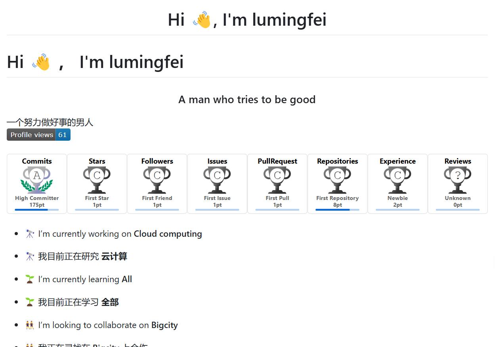
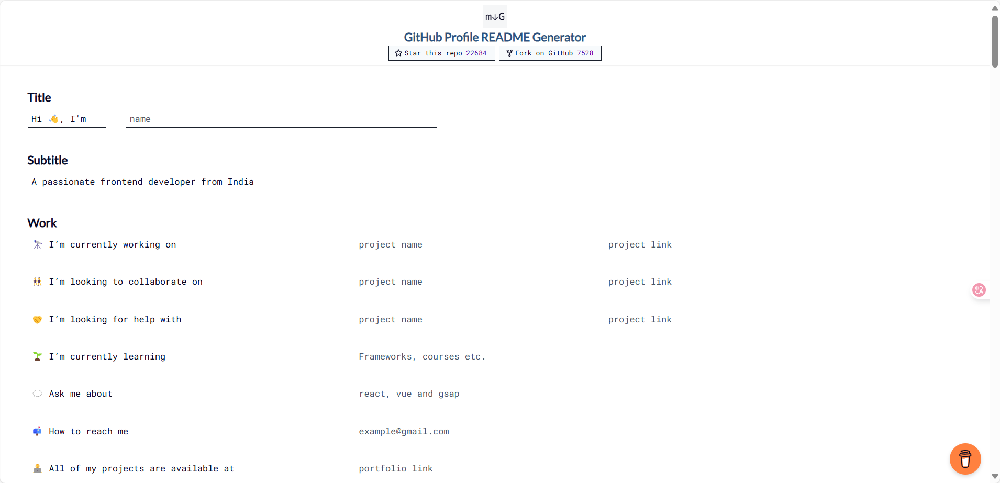
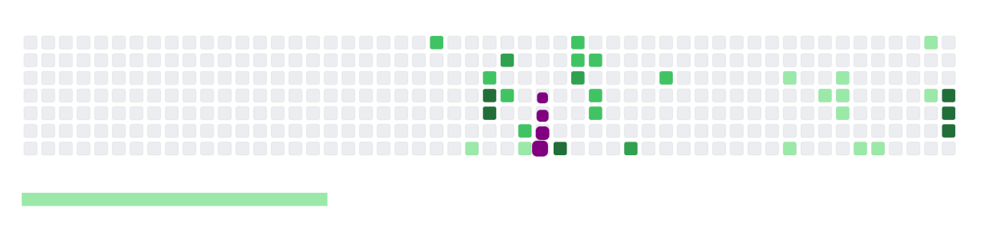
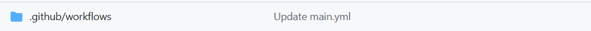
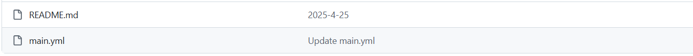
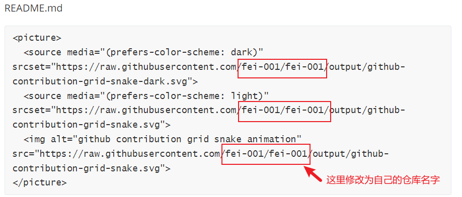

# DIY-github

## 想要DIY一个属于自己的炫酷github主页吗？



[点击这里DIY这样的主页](https://rahuldkjain.github.io/gh-profile-readme-generator/)



### 接下来是贪吃蛇教程



### 首先创建一个文件结构





main.yaml

```
name: generate animation

on:
  # run automatically every 24 hours
  schedule:
    - cron: "0 */24 * * *" 
  
  # allows to manually run the job at any time
  workflow_dispatch:
  
  # run on every push on the master branch
  push:
    branches:
    - main
    
  

jobs:
  generate:
    runs-on: ubuntu-latest
    timeout-minutes: 10
    
    steps:
      # generates a snake game from a github user (<github_user_name>) contributions graph, output a svg animation at <svg_out_path>
      - name: generate github-contribution-grid-snake.svg
        uses: Platane/snk/svg-only@v3
        with:
          github_user_name: ${{ github.repository_owner }}
          outputs: |
            dist/github-contribution-grid-snake.svg
            dist/github-contribution-grid-snake-dark.svg?palette=github-dark
        env:
          GITHUB_TOKEN: ${{ secrets.GITHUB_TOKEN }}
          
          
      # push the content of <build_dir> to a branch
      # the content will be available at https://raw.githubusercontent.com/<github_user>/<repository>/<target_branch>/<file> , or as github page
      - name: push github-contribution-grid-snake.svg to the output branch
        uses: crazy-max/ghaction-github-pages@v3.1.0
        with:
          target_branch: output
          build_dir: dist
        env:
          GITHUB_TOKEN: ${{ secrets.GITHUB_TOKEN }}
```

README.md

```
<picture>
  <source media="(prefers-color-scheme: dark)" srcset="https://raw.githubusercontent.com/fei-001/fei-001/output/github-contribution-grid-snake-dark.svg">
  <source media="(prefers-color-scheme: light)" srcset="https://raw.githubusercontent.com/fei-001/fei-001/output/github-contribution-grid-snake.svg">
  
</picture>
```



#### 最后推送到github仓库即可

